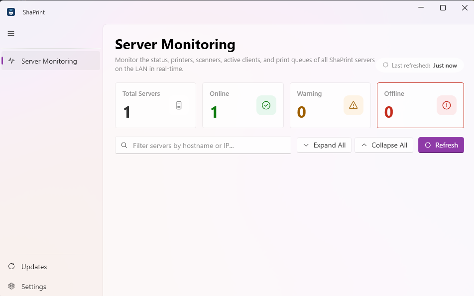

<div align="center">
  
  <h1>ShaPrint</h1>
  <p><b>The Simplest & Most Reliable LAN / Cross-VLAN Virtual Printer Sharing Solution for Windows</b></p>
</div>

---

**ShaPrint** is an advanced, .NET 8-based application designed to reliably share physical printers across local networks (LAN) and cross-subnet/VLAN environments. It serves as a robust alternative when native Windows SMB Printer Sharing fails, struggles with network credential conflicts, or is obstructed by strict Windows security policies.

By utilizing a **Virtual Printer Port (Named Pipes)** architecture and direct TCP/UDP transmission, ShaPrint guarantees that documents are printed with **100% fidelity** and native quality.

---

## ✨ Key Features

- 🎭 **Unified Application:** One executable handles everything. Operate as a **Server** (hosting the physical printer) or a **Client** (routing the documents) from a single unified interface.
- 💎 **Native Driver Quality:** Unlike traditional workarounds that degrade quality to *Generic/Text* or PDF rasterization, ShaPrint leverages the official printer driver (e.g., Epson, HP, Canon) on the Client side. Margins, colors, and layouts are preserved perfectly.
- 🌍 **Cross-VLAN Support:** Use the *Specific Server IP* feature to bypass router boundaries, allowing Clients to connect to Servers located in entirely different subnets or VLANs.
- 🔄 **IP Change Auto-Detection:** Automatically detects when the server IP changes (e.g., DHCP reallocation, network migration) using a stable, unique server identity. It dynamically updates client configurations and restarts active pipe listeners without user intervention or print interruption.
- 🔒 **Enterprise-Grade Security:** Network communication is secured via a shared **Network Channel** password. All discovery payloads are verified using **HMAC signatures**, ensuring only authorized clients can discover or print to your server.
- ⚡ **Seamless Auto-Updater:** ShaPrint includes a built-in background updater. It checks for new releases on GitHub and updates itself seamlessly without interrupting active print jobs.
- 👻 **Stealth Background Service:** Minimize the app to the System Tray to handle print jobs silently. ShaPrint integrates directly with the **Windows Task Scheduler** to automatically start at boot with the highest privileges, entirely bypassing annoying UAC prompts.
- 🔔 **Real-Time Notifications:** Receive native Windows Toast notifications for print job completions, printer errors, client connections/disconnections, and scan results. Works reliably even when the application is minimized to the system tray or running as a background startup service. Clicking a toast instantly restores the application window.
- 📊 **Server Monitoring Mode:** Consolidated dashboard to monitor all active servers on the local network. View real-time server information, network channel, software version, uptime, exposed printer queues, scanner availability, active client connections, recent job histories, and printer/scanner error notifications.
---

## 📸 Screenshots

<div align="center">
<table>
  <tr>
    <td align="center" colspan="5"><b>Switch Mode</b><br></td>
  </tr>
  <tr>
    <td align="center"><b>Server Mode</b><br></td>
    <td align="center"><b>Client Mode</b><br></td>
    <td align="center"><b>Monitoring</b><br></td>
    <td align="center"><b>Settings</b><br></td>
    <td align="center"><b>Update Manager</b><br></td>
  </tr>
</table>
</div>

## 🏗 System Architecture

1. **Server Mode**
   Running on the computer directly connected to the physical printer via USB or LAN, the Server scans for local printers and listens for raw print spool data on **TCP Port 9877**. It also broadcasts its presence using **UDP Port 9876** for auto-discovery.
   
2. **Client Mode**
   The application intercepts print jobs by creating a *Virtual Printer Port* within the Windows Spooler. Any document printed from standard applications (Word, Chrome, Acrobat) to this virtual printer is instantly intercepted and streamed directly to the Server.

3. **Monitoring Mode**
   Operators or users can monitor all active ShaPrint servers across the network channel. It discovers active servers via UDP and queries their status on **TCP Port 9878** to retrieve real-time encrypted details.

---

## 💻 System Requirements

Before installing ShaPrint, please ensure your system meets the following requirements:

* **Operating System:** Windows 10 or Windows 11 (64-bit / `x64` architecture)
* **Minimum Version/Build:** Windows 10 Version 1809 (Build `10.0.17763`) or newer (released November 2018)
* **Pre-requisites:** None. The installation is fully self-contained, meaning you do **not** need to install the .NET Runtime manually.

---

## 🔒 Security & Safety

ShaPrint implements defense-in-depth security to protect your local network, computer performance, and hardware.

### Encryption & Authentication

| Layer | Mechanism | Description |
|---|---|---|
| **TCP Data (Print/Scan/Monitor)** | **AES-256-GCM** | All TCP payloads (print jobs, scan data, monitoring status) are encrypted with AES-256 in Galois/Counter Mode — providing both confidentiality and tamper detection. Each encryption uses a fresh random 96-bit nonce. |
| **UDP Discovery** | **HMAC-SHA256** | Discovery responses are signed with HMAC-SHA256. Clients verify the signature before trusting any server response, preventing spoofing and man-in-the-middle attacks. |
| **Key Derivation** | **PBKDF2 (100k iterations)** | All cryptographic keys are derived from the **Network Channel** shared secret using PBKDF2 with 100,000 iterations and unique salts per purpose (AES, HMAC, local config). |
| **Config Integrity** | **HMAC-wrapped JSON** | Server configuration files are stored with an embedded HMAC to detect tampering. Corrupted or modified configs are rejected on load. |

### Network Protection

- **Rate Limiting:** Discovery server limits requests to **5 per second per IP address**. Stale rate-limit entries are periodically pruned to prevent memory leaks.
- **Payload Size Limits:** Every network payload has a strict maximum size — discovery responses (8 KB), monitor requests (4 KB), print jobs (100 MB). Excessively large payloads are rejected immediately.
- **Input Sanitization:** All strings received from the network (printer names, server names, driver names) are validated against a strict whitelist regex. Shell metacharacters (`' " ; $ \` \| & < > \n \r \t \0`) are explicitly blocked.
- **Concurrency Throttling:** Maximum **10 concurrent print jobs** to prevent resource exhaustion.
- **Firewall Integration:** On server start, Windows Firewall rules for ports 9876/UDP, 9877/TCP, and 9878/TCP are automatically configured (with user consent via UAC prompt). Rules are persistent — only needed once.
- **Connection Timeout:** Monitoring TCP queries time out after **5 seconds**, preventing hung connections from accumulating.

### Performance & Stability

- **Lightweight Polling:** Monitor mode polls servers every **15 seconds** with requests staggered **1 second apart** to avoid network/CPU spikes.
- **Unicast Sweep Control:** Bulk IP sweep (up to 1024 addresses) runs only on **first startup and manual refresh**. Routine polling uses broadcast discovery only (`skipUnicastSweep=true`).
- **In-Memory Logging:** Server logs are stored in memory (max 200 entries) — no continuous disk I/O.
- **Automatic Job Recovery:** PrintMonitorService automatically detects and cancels stuck/error print jobs, preventing spooler congestion.

### Hardware Safety

ShaPrint interacts with hardware **exclusively through standard Windows APIs**:
- **Printing:** Windows Print Spooler API (`AddJob` / spool file injection)
- **Scanning:** Windows Image Acquisition (WIA) 2.0
- **Result:** The application **cannot cause physical damage** to printers, scanners, or computer components. All risks are identical to printing or scanning from any standard Windows application.

### Safety Assessment Summary

| Concern | Verdict | Notes |
|---|---|---|
| **Local network security** | 🟢 **Safe** (with configuration) | AES-256-GCM + HMAC-SHA256 provide strong protection. **Must** customize Network Channel from default for multi-tenant environments. |
| **Computer performance** | 🟢 **Safe** | CPU/RAM impact is negligible for monitoring. Print/scan load is temporary and on-demand. |
| **Hardware damage** | 🟢 **Safe** | Software-only — uses only standard Windows APIs (Spooler, WIA). No risk of physical damage. |

### ⚠️ Critical Recommendations

1. **🔴 Customize Your Network Channel**
   - Go to **Settings → Network Channel**
   - Change from the default `"DefaultChannel"` to a **unique, random string** known only to your devices
   - Share the same value with all clients on your network
   - This regenerates ALL encryption keys — without this, any ShaPrint instance on the same network can decrypt your traffic

2. **Coordinate with IT**
   - Inform your network administrator about these ports:
     - `UDP 9876` — Service discovery
     - `TCP 9877` — Print/scan data transfer
     - `TCP 9878` — Server monitoring status
   - Ask them to restrict access to these ports to your subnet/VLAN only

3. **Use Only on Trusted Networks**
   - ShaPrint is designed for **local LAN / VPN environments**
   - Do not expose ports to the public internet or untrusted WiFi networks

---

## 🚀 Installation

ShaPrint is packaged as a fully self-contained Standalone Setup. You do **not** need to install the .NET Runtime manually.

1. Download the latest `ShaPrint_Setup_vX.Y.Z.exe` from the [GitHub Releases](../../releases) page.
2. Run the installer and follow the prompts.
3. The application will automatically place shortcuts on your Desktop and Start Menu.

---

## 📖 How to Use

> [!IMPORTANT]  
> **Native Driver Requirement:** To guarantee print fidelity, you **must install the official printer driver on the Client PC**. For example, if the Server is hosting an Epson L3210, you must install the Epson L3210 driver on the Client PC beforehand.

### 1. On the Server PC (Hosting the Printer)
1. Open ShaPrint from your Desktop.
2. Ensure you and your clients agree on a **Network Channel** password in the Settings.
3. Select the **Server** tab.
4. Check the boxes next to the physical printers you wish to expose to the network.
5. Click **Start Server**.
6. You may now close the window; the application will silently minimize to the System Tray.

### 2. On the Client PC (Sending Print Jobs)
1. Open ShaPrint. 
2. Ensure your **Network Channel** password matches the Server's exactly.
3. Select the **Client** tab.
4. **Auto-Discovery:** Click **Scan LAN / Connect** if you are on the same local network.
   **Manual Discovery:** Enter the Server's IP address into the "Specific Server IP" box and click Scan if you are on a different VLAN.
5. Select your target printer from the list and click **Install Selected Printer**.
6. Open any application, press `Ctrl + P`, select `ShaPrint - [Printer Name]`, and **Print!**

### 3. Monitoring Server Status
1. Open ShaPrint.
2. Select the **Monitor** tab from the sidebar.
3. The dashboard will automatically scan and list all active servers on your network channel, displaying their status, connected clients, recent jobs, and active printer/scanner status.
4. You can filter servers by hostname/IP, filter by online/offline/warning status, or click "Refresh" to trigger a manual sweep.

---

## ⚙️ Building from Source

To compile the source code and generate the installer yourself, ensure you have the .NET 8 SDK and Inno Setup 6 installed.

### 1. Compile the Application
Open a terminal in the root directory and run the following commands to publish the binaries:
```bash
# Publish the main WPF Application
dotnet publish ShaPrint.WpfApp/ShaPrint.WpfApp.csproj -c Release -r win-x64 --self-contained true -p:PublishSingleFile=true -p:IncludeNativeLibrariesForSelfExtract=true

# Publish the Background Updater
dotnet publish ShaPrint.Updater/ShaPrint.Updater.csproj -c Release -r win-x64 --self-contained true -p:PublishSingleFile=true -p:IncludeNativeLibrariesForSelfExtract=true
```

### 2. Build the Windows Installer
Using PowerShell, compile the `.iss` script:
```powershell
& 'C:\Program Files (x86)\Inno Setup 6\ISCC.exe' installer.iss
```
Your compiled installer (`ShaPrint_Setup_v1.0.x.exe`) will be generated inside the `Output\` directory.

---

## 🛠 Troubleshooting

- **Error: "Driver X is not installed on this computer" (Client):** You must install the official manufacturer driver for the printer on the Client PC before ShaPrint can create the virtual printer.
- **HMAC Verification Failed:** The Client and Server do not share the same Network Channel password. Update the Network Channel in Settings to match exactly.
- **Client cannot find the Server (Empty scan list):** Ensure ports `9876/UDP` and `9877/TCP` are open on the Server's Windows Firewall. If you are on a different subnet, auto-discovery will not work—use the "Specific Server IP" feature.
- **Word freezes or "Connecting to Printer" takes forever:** This indicates Windows Bidirectional Support (BIDI) is enabled. Go to Control Panel -> Devices & Printers -> Right-click the ShaPrint Printer -> Printer Properties -> *Ports* tab -> Uncheck *Enable bidirectional support*.
- **Printed output is gibberish/error codes:** The Printer Driver selected on the Client PC does not match the actual physical printer on the Server PC. Ensure both machines utilize the same driver.

---

<div align="center">
  <b>Developed by ardli-firman</b><br>
  <i>Open Source Print Management</i>
</div>
