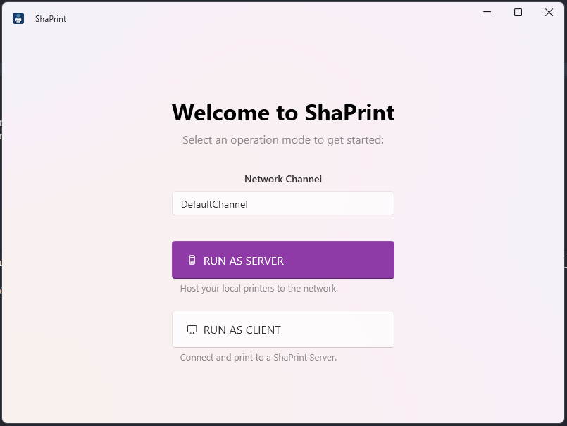
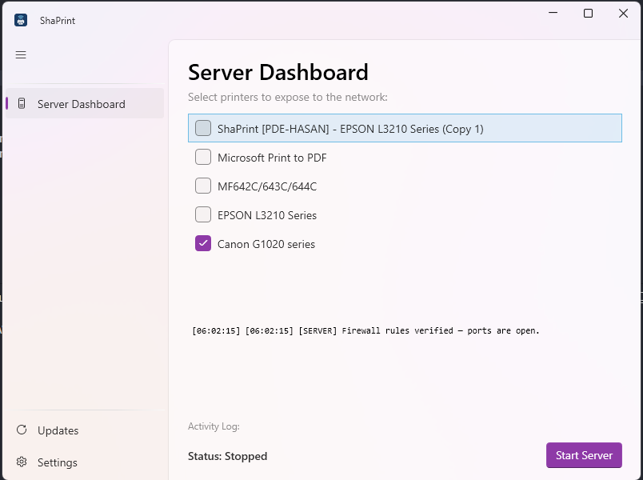
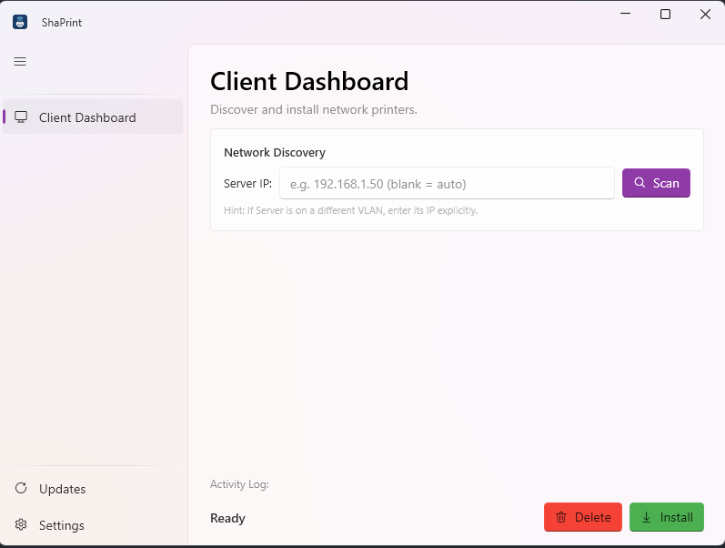
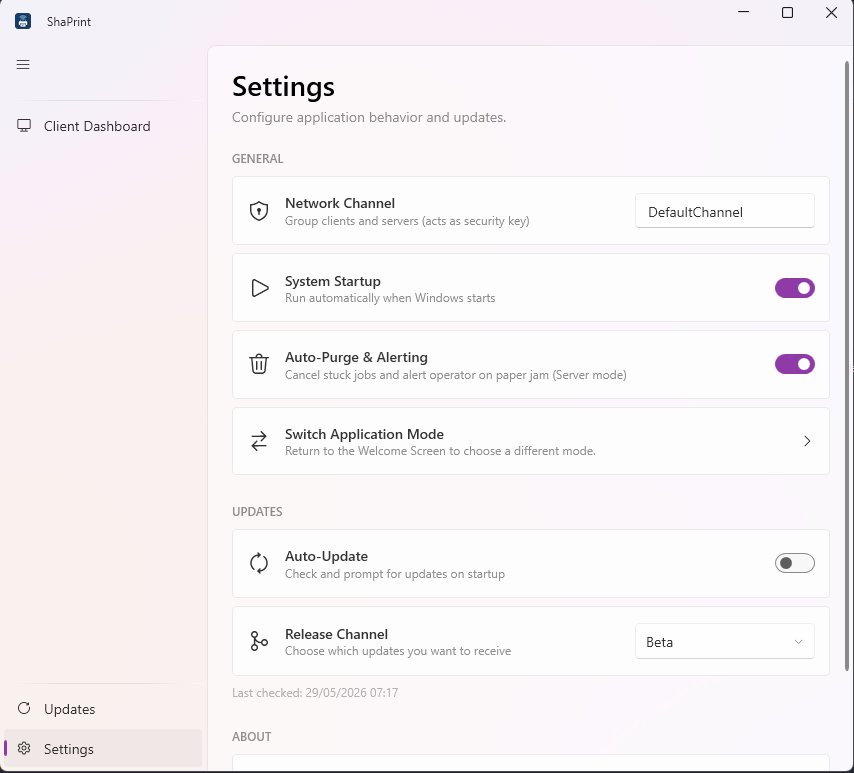
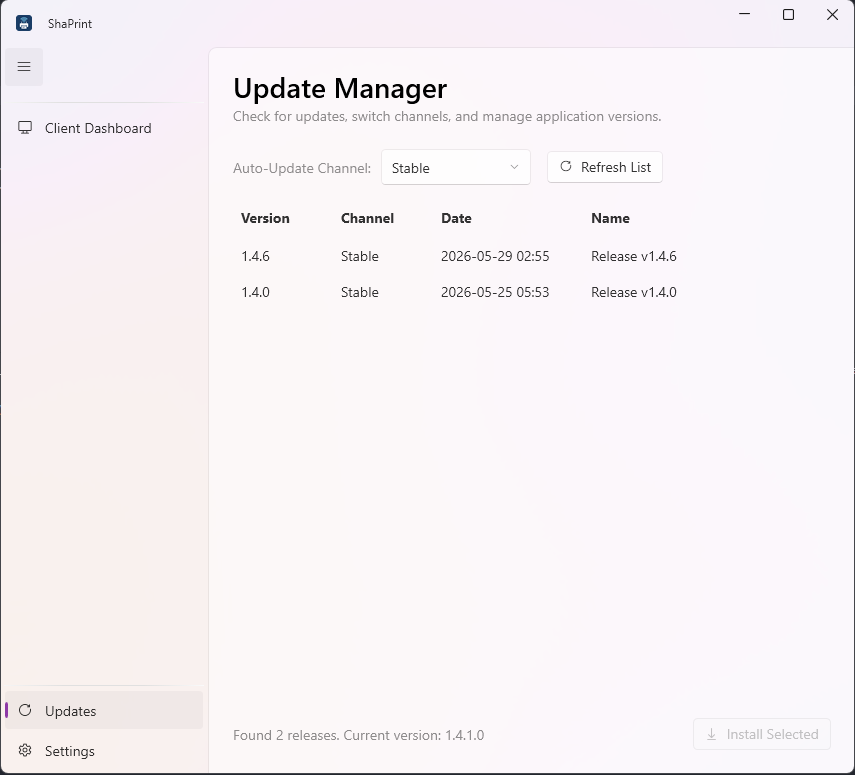

<div align="center">
  <h1>🖨️ ShaPrint</h1>
  <p><b>The Simplest & Most Reliable LAN / Cross-VLAN Virtual Printer Sharing Solution for Windows</b></p>
</div>

---

**ShaPrint** is an advanced, .NET 8-based application designed to reliably share physical printers across local networks (LAN) and cross-subnet/VLAN environments. It serves as a robust alternative when native Windows SMB Printer Sharing fails, struggles with network credential conflicts, or is obstructed by strict Windows security policies.

By utilizing a **Virtual Printer Port (Named Pipes)** architecture and direct TCP/UDP transmission, ShaPrint guarantees that documents are printed with **100% fidelity** and native quality.

---

## ✨ Key Features

- 🎭 **Unified Application:** One executable handles everything. Operate as a **Server** (hosting the physical printer) or a **Client** (routing the documents) from a single unified interface.
- 💎 **Native Driver Quality:** Unlike traditional workarounds that degrade quality to *Generic/Text* or PDF rasterization, ShaPrint leverages the official printer driver (e.g., Epson, HP, Canon) on the Client side. Margins, colors, and layouts are preserved perfectly.
- 🌍 **Cross-VLAN Support:** Use the *Specific Server IP* feature to bypass router boundaries, allowing Clients to connect to Servers located in entirely different subnets or VLANs.
- 🔒 **Enterprise-Grade Security:** Network communication is secured via a shared **Network Channel** password. All discovery payloads are verified using **HMAC signatures**, ensuring only authorized clients can discover or print to your server.
- ⚡ **Seamless Auto-Updater:** ShaPrint includes a built-in background updater. It checks for new releases on GitHub and updates itself seamlessly without interrupting active print jobs.
- 👻 **Stealth Background Service:** Minimize the app to the System Tray to handle print jobs silently. ShaPrint integrates directly with the **Windows Task Scheduler** to automatically start at boot with the highest privileges, entirely bypassing annoying UAC prompts.

---

## 📸 Screenshots

<div align="center">
<table>
  <tr>
    <td align="center" colspan="4"><b>Switch Mode</b><br></td>
  </tr>
  <tr>
    <td align="center"><b>Server Mode</b><br></td>
    <td align="center"><b>Client Mode</b><br></td>
    <td align="center"><b>Settings</b><br></td>
    <td align="center"><b>Update Manager</b><br></td>
  </tr>
</table>
</div>

## 🏗 System Architecture

1. **Server Mode**
   Running on the computer directly connected to the physical printer via USB or LAN, the Server scans for local printers and listens for raw print spool data on **TCP Port 9877**. It also broadcasts its presence using **UDP Port 9876** for auto-discovery.
   
2. **Client Mode**
   The application intercepts print jobs by creating a *Virtual Printer Port* within the Windows Spooler. Any document printed from standard applications (Word, Chrome, Acrobat) to this virtual printer is instantly intercepted and streamed directly to the Server.

---

## 🚀 Installation

ShaPrint is packaged as a fully self-contained Standalone Setup. You do **not** need to install the .NET Runtime manually.

1. Download the latest `ShaPrint_Setup_vX.Y.Z.exe` from the [GitHub Releases](../../releases) page.
2. Run the installer and follow the prompts.
3. The application will automatically place shortcuts on your Desktop and Start Menu.

---

## 📖 How to Use

> [!IMPORTANT]  
> **Native Driver Requirement:** To guarantee print fidelity, you **must install the official printer driver on the Client PC**. For example, if the Server is hosting an Epson L3210, you must install the Epson L3210 driver on the Client PC beforehand.

### 1. On the Server PC (Hosting the Printer)
1. Open ShaPrint from your Desktop.
2. Ensure you and your clients agree on a **Network Channel** password in the Settings.
3. Select the **Server** tab.
4. Check the boxes next to the physical printers you wish to expose to the network.
5. Click **Start Server**.
6. You may now close the window; the application will silently minimize to the System Tray.

### 2. On the Client PC (Sending Print Jobs)
1. Open ShaPrint. 
2. Ensure your **Network Channel** password matches the Server's exactly.
3. Select the **Client** tab.
4. **Auto-Discovery:** Click **Scan LAN / Connect** if you are on the same local network.
   **Manual Discovery:** Enter the Server's IP address into the "Specific Server IP" box and click Scan if you are on a different VLAN.
5. Select your target printer from the list and click **Install Selected Printer**.
6. Open any application, press `Ctrl + P`, select `ShaPrint - [Printer Name]`, and **Print!**

---

## ⚙️ Building from Source

To compile the source code and generate the installer yourself, ensure you have the .NET 8 SDK and Inno Setup 6 installed.

### 1. Compile the Application
Open a terminal in the root directory and run the following commands to publish the binaries:
```bash
# Publish the main WPF Application
dotnet publish ShaPrint.WpfApp/ShaPrint.WpfApp.csproj -c Release -r win-x64 --self-contained true -p:PublishSingleFile=true -p:IncludeNativeLibrariesForSelfExtract=true

# Publish the Background Updater
dotnet publish ShaPrint.Updater/ShaPrint.Updater.csproj -c Release -r win-x64 --self-contained true -p:PublishSingleFile=true -p:IncludeNativeLibrariesForSelfExtract=true
```

### 2. Build the Windows Installer
Using PowerShell, compile the `.iss` script:
```powershell
& 'C:\Program Files (x86)\Inno Setup 6\ISCC.exe' installer.iss
```
Your compiled installer (`ShaPrint_Setup_v1.0.x.exe`) will be generated inside the `Output\` directory.

---

## 🛠 Troubleshooting

- **Error: "Driver X is not installed on this computer" (Client):** You must install the official manufacturer driver for the printer on the Client PC before ShaPrint can create the virtual printer.
- **HMAC Verification Failed:** The Client and Server do not share the same Network Channel password. Update the Network Channel in Settings to match exactly.
- **Client cannot find the Server (Empty scan list):** Ensure ports `9876/UDP` and `9877/TCP` are open on the Server's Windows Firewall. If you are on a different subnet, auto-discovery will not work—use the "Specific Server IP" feature.
- **Word freezes or "Connecting to Printer" takes forever:** This indicates Windows Bidirectional Support (BIDI) is enabled. Go to Control Panel -> Devices & Printers -> Right-click the ShaPrint Printer -> Printer Properties -> *Ports* tab -> Uncheck *Enable bidirectional support*.
- **Printed output is gibberish/error codes:** The Printer Driver selected on the Client PC does not match the actual physical printer on the Server PC. Ensure both machines utilize the same driver.

---

<div align="center">
  <b>Developed by ardli-firman</b><br>
  <i>Open Source Print Management</i>
</div>
